## 
 Hi everybody🤟, I am iOS Developer   

My name is Iurii, Im from Russia, Saint-Petersburg. Commenced independent study of the Swift programming language in October 2022. I pursued learning primarily through books, courses, and a variety of other freely available resources that I could find. Starting from the spring of 2023, I began building my portfolio by creating various small-scale applications using different frameworks. This was aimed at gaining practical experience and reinforcing the knowledge I had acquired. I consistently upload all of my projects to my GitHub repository.

## 
 Contact me 👍

 

  
   <strong>+7 911 165 23 26</strong>

  
  <strong>kruchman@bk.ru  
   
  kruchman96@gmail.com</strong>

  
  <strong>https://t.me/kruchmanYu</strong>

## 
 Projects 🧑‍💻

- [TheCocktailApp](https://github.com/kruchman/Cocktail-App): "
The application is developed using the SwiftUI framework and follows the MVVM architecture pattern. It features a list displaying classic cocktails with individual details. Users can navigate to a detailed view for each cocktail to obtain more information. Additionally, users can add cocktails to their "Favorites" list and remove them using Core Data. Firebase Firestore Database is used as the backend database. The application also allows users to create custom cocktails. Custom animations have been implemented to enhance the user experience. For sorting and filtering cocktails, the Combine framework is utilized."

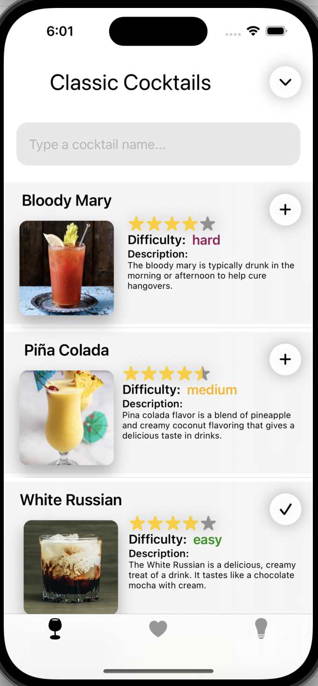 
 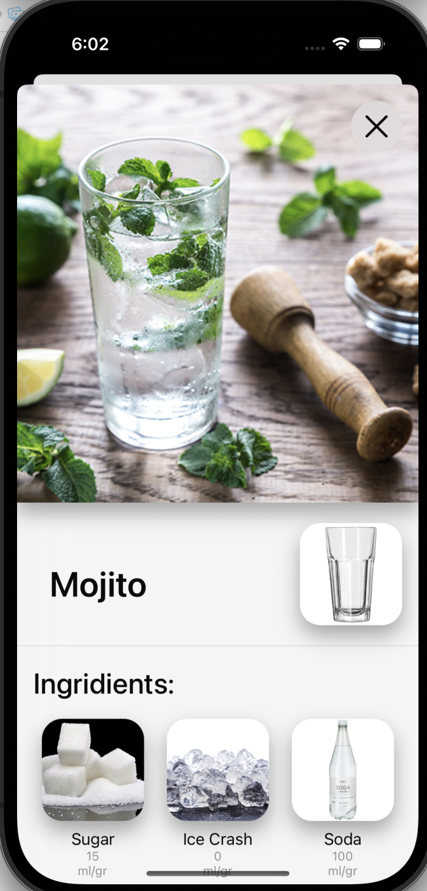
 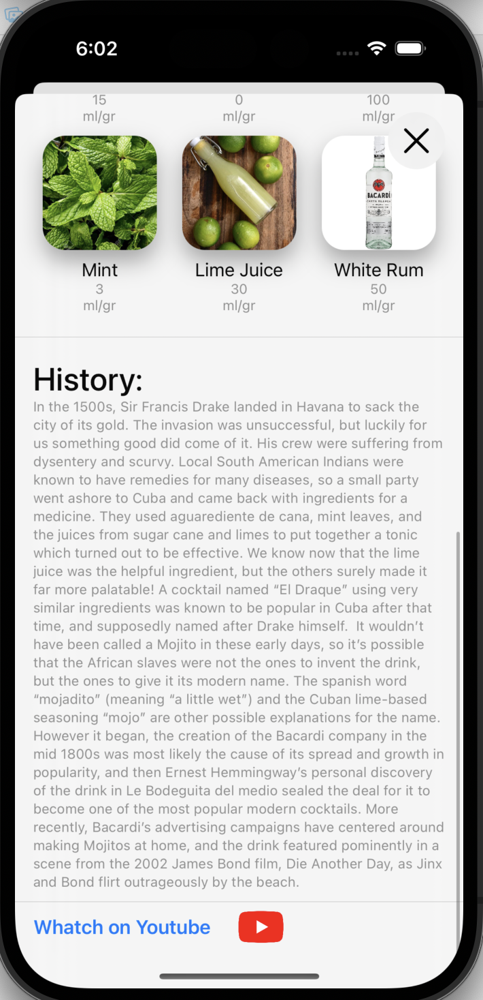
 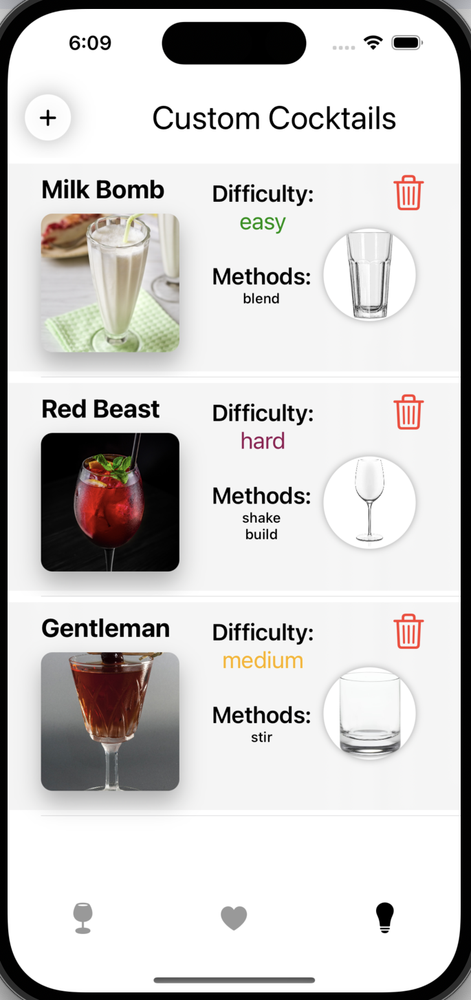
 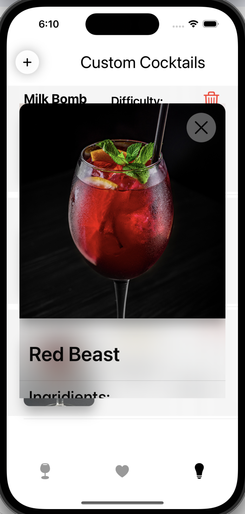
 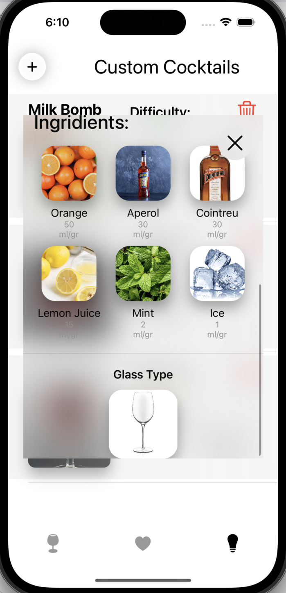

 
 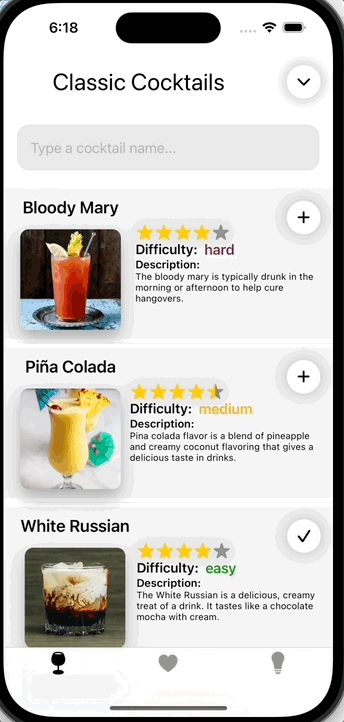
 
 

- [TheGamerApp](https://github.com/kruchman/TheGamerApp): "
SwiftUI, MVVM. This application utilizes a third-party API (Firebase), specifically tools such as FirebaseAuth, Firestore, and FirebaseStorage. Implemented features include: login and password validation, chats, profile creation, editing, and deletion."

  

     
    
  
  
  
  
  
  
  

- [Currency](https://github.com/kruchman/Currency): "
SwiftUI, MVVM. An application for current currency exchange rates. Implemented logic for correct currency conversion and networking."
  

  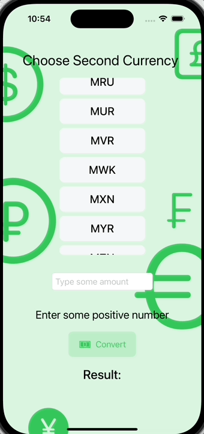

- [Give me joke](https://github.com/kruchman/Give-me-joke): "UIKit, MVC. This application implements networking, specifically a GET request using async-await. Core Data is utilized for data management."

  

  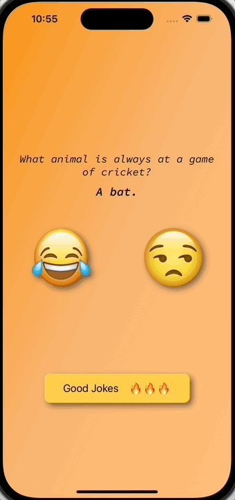

- [Guess The Animal](https://github.com/kruchman/Guess-The-Animal): "The project is written in UIKit using the MVC architecture. Some business logic has been implemented to ensure the correct functioning of the application. Additionally, unit and UI tests have been written for this project."

  

  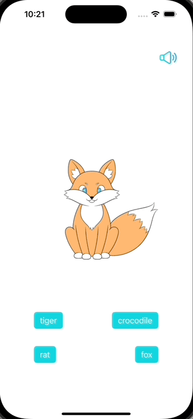

- [Goal setter](https://github.com/kruchman/Goal-setter): "A typical ToDoApp written in UIKit using the MVC pattern, TableView, and Core Data for data management."

  

  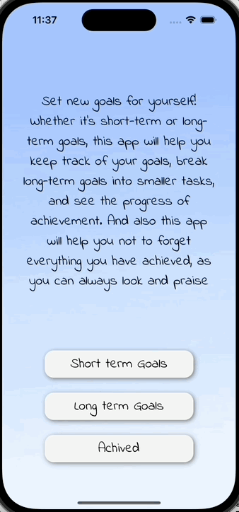

